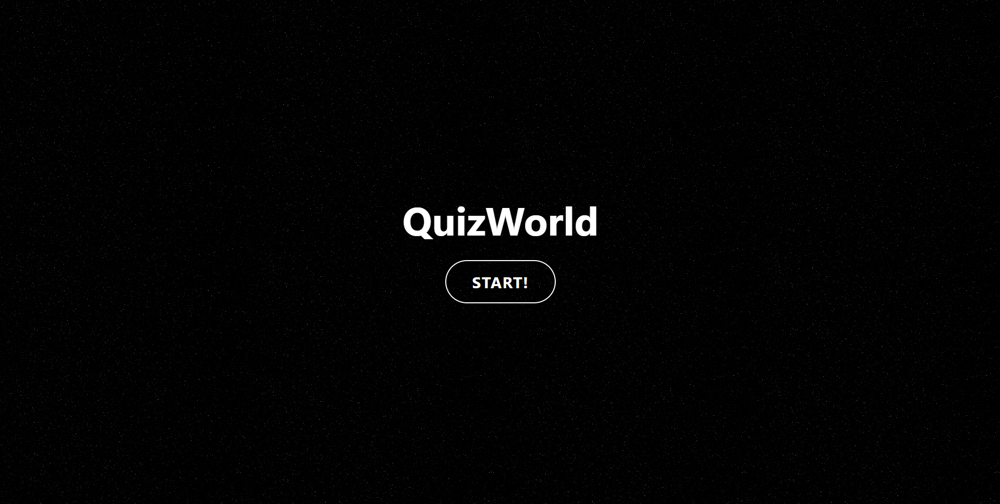
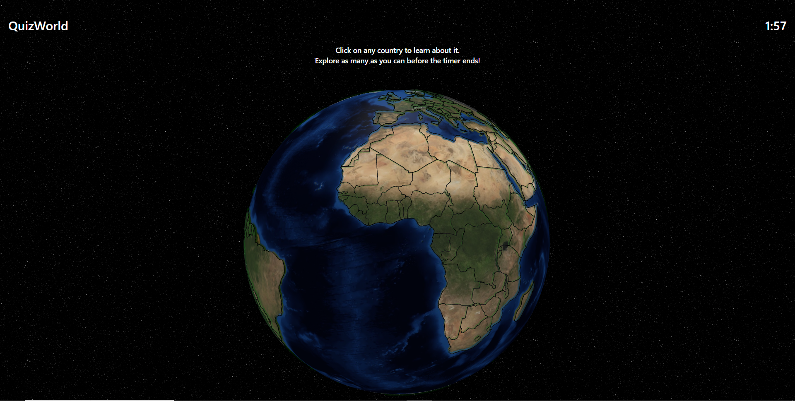
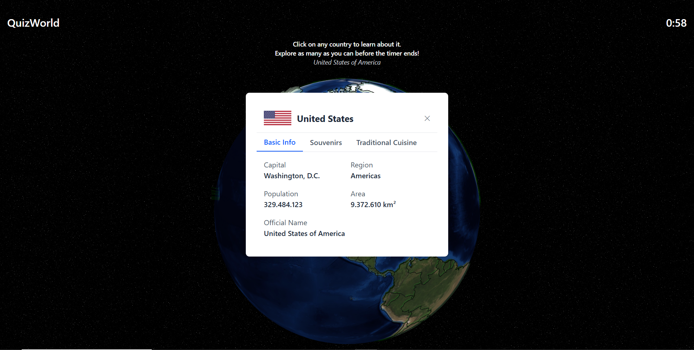
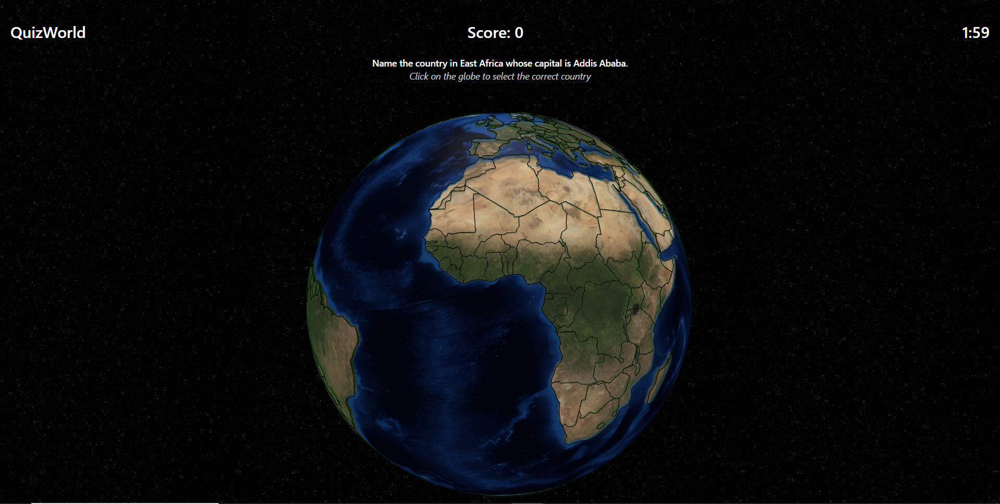
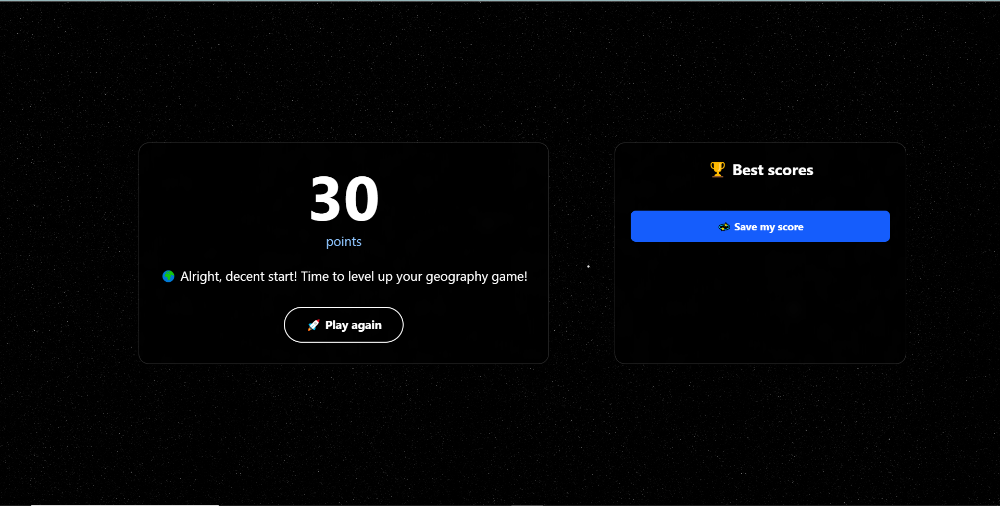

# Quiz World 🌍

Quiz World is an interactive web application that combines geography learning with an engaging 3D globe interface. Test your knowledge about countries while exploring a beautiful 3D representation of our planet.

## 🌟 Features

- Background music option for enhanced experience
- Beautiful UI with smooth animations using Framer Motion
- Interactive 3D globe visualization using globe.gl
- Country-based quiz system
- Real-time feedback on answers
- PostgreSQL database for storing quiz data
- Docker-based deployment for easy setup

## 🛠️ Technologies Used

- **Frontend:**
  - Next.js
  - Three.js
  - Globe.gl
  - TailwindCSS

- **Backend:**
  - Next.js API Routes
  - PostgreSQL 

- **Development & Deployment:**
  - ESLint
  - Docker

## 🚀 Installation

1. Clone the repository:
   ```bash
   git clone https://github.com/yourusername/quiz-world.git
   cd quiz-world
   ```

2. Configure environment variables:
   ```bash
   # Copy the environment variables template
   cp .env.example .env
   
   # Edit the .env file with your specific configuration
   # Make sure to set up your database credentials and other required variables
   ```

3. Start the application using Docker Compose:
   ```bash
   docker-compose up -d
   ```

4. Import the database backup:
   ```bash
   # The container name 'quiz-world-db-1' is automatically generated by Docker Compose
   # using the pattern: [project-directory-name]-[service-name]-[instance-number]
   # The database credentials are taken from your .env file
   docker exec -i quiz-world-db-1 psql -U your_postgres_user -d your_database_name < backup_quizworld.sql
   ```

5. Access the application:
   Open your browser and navigate to `http://localhost:3000`

## 📝 Important Notes

### Country Data Management
- Country information is scraped and stored in `countries_data.json`
- The Dockerfile automatically handles the build process:
  - If `countries_data.json` exists, it runs `npm run build`
  - If the file doesn't exist, it runs `npm run build-with-data`
- The build process includes:
  - `build-with-data`: `npm run build-data && npm run build --no-lint`
  - `build-data`: `node scripts/buildCountriesData.js`

### Background Music
- Background music component available in `src/components/backgroundMusic.tsx`
- Music file: `public/music/background-music.flac`
- To enable background music, add the component to the root layout:
  ```tsx
  import BackgroundMusic from '@/components/backgroundMusic'
  
  // In your root layout, after <body> and before {children}:
  <BackgroundMusic />
  ```

### Globe Visualization
- The globe uses the `globe.gl` library with custom polygons for country relief
- Background texture: `public/images/earth-blue-marble`
- Country coordinates are stored in `public/data/countries-110m.json` (TopoJSON format)
- Note: If clicking on a country doesn't show its information, it means that while the country exists in `public/data/countries-110m.json`, it wasn't found in the scraped data. This can happen if the country is stored under a different name in the source website or if it's not included in the source data at all
- Important: When adding new quiz questions, ensure the countries exist in the TopoJSON file

## 🎮 Game Preview

### Introduction


### World Exploration


### Country Information


### Quiz Questions


### Score Display


## More Information
- [Presentación del Proyecto](./docs/presentation.pdf)

## 🤝 Contributing

This is an open-source project, and contributions are welcome! Feel free to submit issues, fork the repository, and create pull requests.

## 👨‍💻 Author

- **Luis Peraza** - Project Creator

## 📄 License

This project is licensed under the MIT License - see the [LICENSE.md](LICENSE.md) file for details.